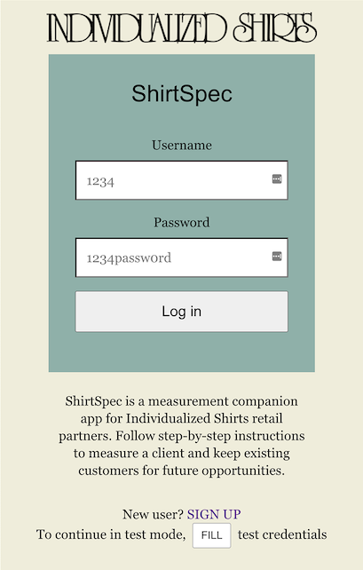
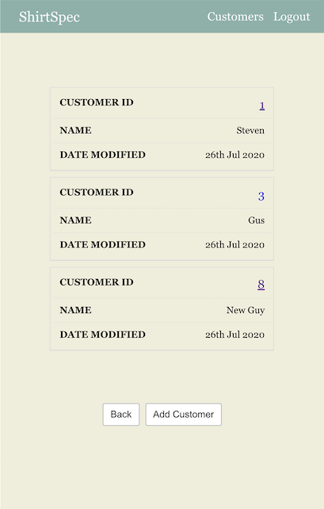
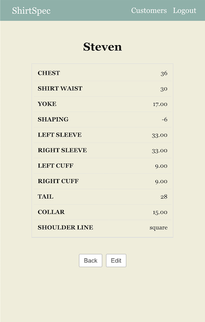
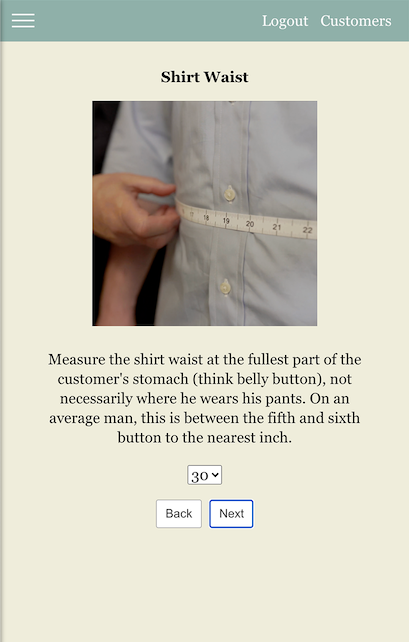
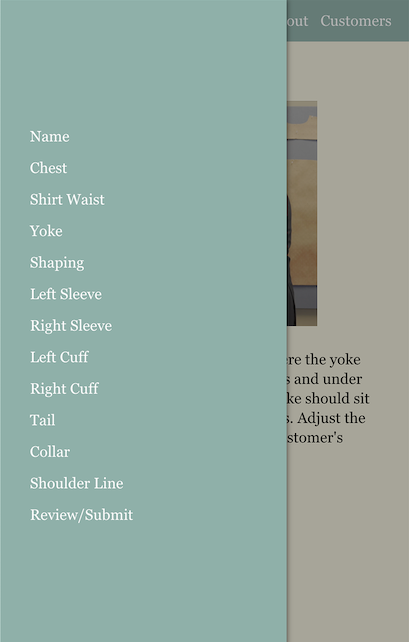

<!-- # ShirtSpec-->
# ShirtSpec

ShirtSpec is a measurement companion app for Individualized Shirts retail partners. Designed specifically with new trainees in mind, ShirtSpec guides fitters through the custom shirt fitting process ensuring that they accurately record key values within the scope of the nation's most comprehensive custom shirt program.

## Motivation

I have personally been an IS partner for nearly a decade now, and though the fitting program has advanced and become more detailed/thorough, the online ordering portal has significantly lagged behind. This project truly is the earliest, minimal iteration in what I hope can become a worthy successor to the current online order form. There's a long way to go from here--measurement validations are the most pressing need at the moment, but to replace the ol' fax machine we haven't even scratched the surface.

## Build Status

Version 1.0 gets the customers and their measurements on the board for a given store (aka "retail partner"). At the moment, customer edits take precedence as generally MTM customers are loyal to program and repeat business, so no immediate need to delete customers. For new fitters, measurement logic/validations will be most valuable to this project, which is in-progress. Thankfully the current training program has these measurement limits and warnings well-documented, so it's just a matter of transcribing them--time consuming, nonetheless.

## Screenshots
Landing Page/Log In

Customers Screen:

Customer Info: 

Measurement Instruction Page

Responsive Nav/Sidebar

Review/Submit Page

## Built With

### Front-End
* HTML
* CSS (No frameworks)
* Javascript
* React (Create React App, React Router)

### Testing
* Jest (Smoke tests)

### Production
* Deployed via Vercel

## Upcoming features

* Measurement validations and pattern limit warnings 
* Delete a customer
* Fabric availability
* UX/UI improvements

## Demo

- [Live Demo](https://shirtspec-app.vercel.app/)

## Getting Started

cd to `shirtspec-app`

Run `npm install` to load dependencies

Run `npm test` to ensure build is stable

This repository only contains the front-end client. To develop locally, the server is required which can be found at the repository below:

[https://github.com/StevieReyJuan/shirtspec-api](https://github.com/StevieReyJuan/shirtspec-api)

## Authors

* **S. Reyes** - Development

## Acknowledgments

* **Mario Mol** - My mentor--Can't thank you enough for your guidance. 

* **David Dumont** My IS rep. Thanks for the resources!